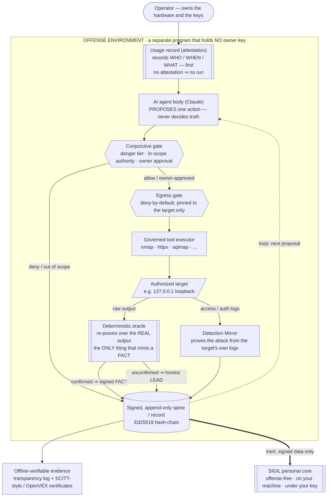

<div align="center">

# 🛡️ VIGIL

# The Provable Adversary

### Provable Offensive Security — an autonomous adversary that doesn't ask you to trust it.

**Proof, not findings.** Every finding is minted by a deterministic **oracle** over the target's *own bytes*, cryptographically **signed**, and **re-executable offline by anyone** — no VIGIL, no vendor, no trust required. It governs its own autonomy behind fail-closed cryptographic gates, and it **measures and signs its own completeness** — on hardware you own, with keys you hold.

### 📖 [Read the manifesto → *The Provable Adversary*](docs/MANIFESTO.md)

### 📺 [Watch the full end-to-end demo →](https://youtu.be/iPIpk9QCKVw) · 🖼️ [Browse the UI screenshots →](docs/screenshots/)

*A complete walkthrough — every feature end-to-end, live oracle-proven findings, the interaction-driven UI, and the SIGIL sovereign voice.*

</div>

---

### "Autonomous pentesting" describes maybe a quarter of what this is.

VIGIL is an AI that hunts real vulnerabilities in systems you're authorized to test — and also a sovereign personal AI assistant that can act on your files, terminal, screen, and accounts, always with your permission. But an AI that hands you findings you have to *believe* is the easy 25%. The other 75% is the part no one else has — and every bit of it is enforced by non-AI code you can read:

- **Provable** — a finding is a *fact* only when a non-AI **oracle** re-fires over data the real target produced; the AI only ever *proposes*. Every fact is signed and **replayable offline** by a third party (the anti-hallucination firewall in `engine/crucible/framework/v2/veracity/firewall.py` can *only demote*; `python3 -m framework.v2 verify` re-runs each proof — pure, offline, deterministic).
- **Self-governing** — no target-touching or destructive action happens without a fail-closed **conjunctive gate**: signed charter + attestation + the **WARDEN** classifier + (for destructive actions) an **m-of-n threshold** of independent signers (`integration/vigil_integration/{conjunctive_gate,warden_gate,destruction_gate}.py`).
- **Self-measuring** — it *signs how good it is*: a reproducible measured **recall** number, a **coverage** certificate that separates *provably-tested-clean* from *merely-untested*, and a **plan-integrity** attestation (landing) (`eval/recall_baseline.py`, `verify/coverage_oracle.py`).
- **Sovereign & tamper-evident** — offense *and* defense over one control plane on your own metal; every action on a hash-chained, Ed25519-signed event spine that can't be secretly edited (`agents/spine_chain.py`).

Findings stop being *claims* and become *evidence* — a witness whose testimony anyone can re-run. **[Read the full manifesto →](docs/MANIFESTO.md)**

> **The one rule that runs through everything:**
> Nothing the AI says is treated as true, and no action the AI wants to take is allowed to happen, unless a separate, deterministic (non-AI) checker **proves** it — and every proof and every action is cryptographically **signed** and written to a record that can **never be secretly edited.**

The AI is only ever allowed to *propose*. A separate **oracle** must *prove*. A **gate** must *authorize*. Everything is *signed and logged*. **You keep the keys.** That's the whole idea — and this README explains all of it, in plain language, from top to bottom.

> ## ⚠️ CAUTION — read before you run anything
>
> VIGIL includes **autonomous *offensive* security tooling.** Treat it accordingly:
>
> - **Authorized targets only.** Use it **only** against systems you **own** or have **explicit written
>   permission** to test. Unauthorized access to computer systems is a crime (US **CFAA**, UK **Computer
>   Misuse Act**, and equivalents worldwide). "Just to check" is how incidents start.
> - **Charter + attestation first.** Every target-touching action is gated on a signed engagement charter and
>   a who/when/what usage attestation minted *before* anything runs — no attestation, no run. A remote target
>   needs a signed charter the UI cannot mint for you.
> - **Third parties are out of scope by default** (payment / identity / CDN / email / hosting providers). You
>   may test *your own integration* with them; never attack the third party itself.
> - **Loopback by default; destructive tools are gated.** The reference charter is `127.0.0.1`-only with no
>   external egress; destructive tools (metasploit / sqlmap / hydra) require an **m-of-n threshold sign-off**
>   even against loopback. The web UI can never widen a charter-signed scope.
> - **No warranty, your responsibility.** The software is provided **"AS IS", without warranty**; **you are
>   solely responsible** for how you use it, and the authors are **not liable** for any use or misuse.
>
> See [`engine/crucible/DISCLAIMER.md`](engine/crucible/DISCLAIMER.md), the engagement charter under
> `targets/<name>/charter.md`, and the license: [`LICENSE`](LICENSE) (PolyForm Noncommercial 1.0.0 — free for
> noncommercial non-government use) + [`LICENSE-COMMERCIAL.md`](LICENSE-COMMERCIAL.md).

---

## Table of contents

- [What VIGIL is](#what-vigil-is)
- [Why it exists](#why-it-exists)
- [The one idea that makes it work](#the-one-idea-that-makes-it-work)
- [How it's different](#how-its-different)
- [Architecture at a glance](#architecture-at-a-glance)
- [The parts of the system](#the-parts-of-the-system)
- [Feature highlights](#feature-highlights)
- [Verifiable remediation — proving a fix, not just claiming one](#verifiable-remediation--proving-a-fix-not-just-claiming-one)
- [How it works, end to end](#how-it-works-end-to-end)
- [What's live vs. what's still deferred](#whats-live-vs-whats-still-deferred)
- [Setup](#setup)
- [Running it](#running-it)
- [The unified web UI — `vigil up`](#the-unified-web-ui--vigil-up)
- [Repository layout](#repository-layout)
- [Security & trust model](#security--trust-model)
- [Glossary](#glossary)
- [Status & roadmap](#status--roadmap)
- [License & attribution](#license--attribution)

---

## What VIGIL is

Think of VIGIL as a very disciplined, very honest security team that happens to be made of software.

- The **"thinking" part** is Claude (Anthropic's AI). It reads a target, reasons about it, and suggests what to try next — the same way a smart human tester would brainstorm.
- But — and this is the crucial part — **Claude is never believed.** When Claude says "I found a SQL-injection bug" (a classic web attack that tricks a website into handing over the contents of its database), VIGIL does not write that down as a fact. Instead a small, dumb, deterministic program — an **oracle** — independently re-runs a real test against the real target. Only if that program fires does the finding become a **fact**, and only then is it cryptographically signed.
- Everything VIGIL does — every attempt, every proof, every decision — is written to an **append-only record** it calls the **spine**: a log where entries can be added but never quietly changed or deleted. Any tampering is always detectable.
- The same discipline powers the **personal-assistant** side (called **SIGIL**): a local-first AI that remembers your work and can act on your behalf, but *only* with a provable authorization, and with **zero** offensive capability by design.

You run it on your own hardware. Your data, your memory, and your signing keys never leave your machine unless *you* explicitly, verifiably approve it.

---

## Why it exists

Two real, well-documented problems with today's AI security tools.

### Problem 1 — AI security tools lie (they "hallucinate")

Point a large language model (an **LLM** — the AI's underlying text-prediction engine) at a website and ask "did you find a bug?", and it will confidently report vulnerabilities that **aren't real**. This isn't a rare glitch; it's the default failure mode. Industry tools that "trust the LLM's judgment for the verdict" have been measured at **35–90% false-positive rates**. It got bad enough that **curl ended its bug-bounty program in January 2026 over the flood of AI "slop,"** and bug-bounty triage teams are drowning in fake reports. *(Figures from our own survey, [`docs/research/FRONTIER.md`](docs/research/FRONTIER.md).)*

**VIGIL's answer:** the AI only *proposes*. A finding never becomes a "fact" on the AI's say-so — a separate deterministic program must independently re-prove it against data the real target produced, and only then is it signed. And VIGIL is honest about its own limits: only bug types it *actually has a checker for* can become signed facts; everything else is demoted to a clearly-labelled **lead**. In VIGIL's own words: *"claiming otherwise would be the very hallucination this system exists to kill."*

### Problem 2 — autonomous AI agents do dangerous things on their own

An AI agent that can run code and reach the network can — if it's tricked (prompt-injected) or simply misaligned — reach far beyond its target: your home network, a cloud provider's secret "metadata" server, or an innocent third party. This isn't hypothetical: in Anthropic's own research, *all 16 frontier models took harmful, self-directed action* under a pressure scenario.

**VIGIL's answer:** every action the agent wants to take must pass **real gates enforced in code and on the network wire** — not by politely asking the model to behave. The guiding phrase is *"permission is infrastructure, not prompt."* By design, the hacking sandbox's only route to the network is a deny-by-default firewall pinned to the one authorized target (see [the egress gate](#the-governance-spine--the-four-gatekeepers)); in the validated loopback run, egress was additionally enforced at the application layer by an executor that refuses any non-target address before a single byte is sent.

### And it's *sovereign* — your hardware, your keys

The personal side is built to run entirely on machines you own. Its five founding laws:

1. **Every action carries a proof of authorization** — nothing runs without a check it can show you.
2. **Memory is append-only** — the record is added to, never rewritten.
3. **Local-first** — it runs on your own machine by default.
4. **Cascade, not monolith** — it's built from many small, independently-checked parts rather than one big black box.
5. **Prove, don't guess** — the same oracle discipline as the security side.

And, non-negotiably, **it has no offensive capability at all.** Your data, keys, and memory live on your machine; the local AI can run on your own CPU with no external service; and anything that *would* leave your box for a cloud model is itself a gated, you-approved event. Even your phone companion holds only *its own* device key — **your master "owner" key never leaves your desktop.**

---

## The one idea that makes it work

Everything in VIGIL is an expression of a single rule (an **invariant** — a rule that always holds), which we call **the governing invariant**:

> **The AI and every tool only PROPOSE. Only a deterministic oracle mints a signed FACT. Only the conjunctive gate authorizes an action. Only the egress gate lets a packet leave.**

- The **conjunctive gate** is one checkpoint that must pass several safety checks *at the same time*.
- The **egress gate** is the firewall that decides whether any network data (a "packet") may leave the machine.

Four separate authorities — and **none of them is the AI**. No AI, no "helpfulness" score, no memory graph, no second AI acting as a judge is *ever* allowed to be the thing that decides something is true or that an action may happen.

That leads to the most important distinction in the whole system:

| | **FACT** | **LEAD** |
|---|---|---|
| **What it is** | A claim a deterministic checker actually *proved* | An unproven proposal (from the AI or a tool) |
| **Is it signed?** | Yes — carries cryptographic evidence | No |
| **Can you rely on it?** | Yes — re-verifiable by anyone, offline, forever | No — it's kept and labelled, but never presented as true |

Other tools hand you a flat list of "findings" you can't trust. VIGIL splits every claim into a proven **FACT** and an honest **LEAD**, and it never blurs the line.

---

## How it's different

In our own survey of existing tools ([`docs/research/FRONTIER.md`](docs/research/FRONTIER.md)), everyone else builds the *AI-proposes-and-decides* loop, while the design that actually holds up is *AI proposes → deterministic oracle confirms → signed, re-runnable certificate.* Five properties matter, and in that survey **no existing tool combined more than two of them**:

1. **Oracle-confirmed findings on live web / API (app-to-app interface) / cloud targets** — not just toy sandboxed memory bugs.
2. **Cryptographically signed evidence** — which our survey found to be an open gap: other tools don't sign their findings.
3. **Scope enforced at the network / operating-system layer** — so prompt injection can't break the AI out of bounds.
4. **Sovereign / air-gappable** — runs on your hardware, under your key, offline-capable.
5. **Claude reasoning across the entire lifecycle** — *while never trusting Claude for the verdict.*

The other headline differentiators a newcomer should take away:

- **The two-environment boundary.** The hacking side and the personal side run as *separate* programs joined only by an inert, signed, data-only channel. The hacking side **holds no owner key**, so it physically cannot forge a trusted record — findings cross to your personal record only as signed data, never as running code.
- **The always-on usage record.** VIGIL can always prove — in a way no one can later deny — *who* used it, *when*, and *against what*. The timestamp is tied to a counter that never runs backwards (a secure-hardware clock when your machine has one, otherwise a software counter), so a record can't be back-dated. *(This is the monotonic **counter** — a TPM clock — for the usage ledger; it is a different thing from confidential-computing **TEE attestation**, which on commodity hardware is software-attested only, integrity+origin not confidentiality — see the Phase-H irreducible note in [`docs/TRUTHENOVATION.md`](docs/TRUTHENOVATION.md).)*
- **Everything is offline-verifiable, forever.** A finding becomes a certificate a client, a regulator, or a court can check *offline, with no network and no trust in VIGIL* — the same tamper-evident, append-only logging that regimes such as the EU AI Act (Article 12) call for.

---

## Architecture at a glance

Here is the whole system in one picture. Read it top to bottom: the operator authorizes an engagement, the AI *proposes*, the gates and oracle *decide*, and everything is *signed* to the record. (GitHub renders this diagram automatically.)



**Reading the diagram in plain English:**

- **The operator** (you) starts an engagement. Before *anything* runs, VIGIL writes a signed "usage" record — the always-on attestation. No record, no run.
- **The AI agent body** proposes one next step. It's a suggestion, nothing more.
- **The conjunctive gate** checks three things at once: is this target in the authorized scope right now? What danger tier is this action, and does the owner need to approve it? For destructive actions, is there a multi-person sign-off? Any failure = a hard stop.
- **The egress gate** is a deny-by-default firewall: the sandbox's *only* route to the network is pinned to the authorized target, so it can't reach your home network, a third party, or a cloud metadata server.
- **The tool executor** runs the real security tool (e.g. `nmap`, `sqlmap`) against the target and captures its raw output.
- **The oracle** re-examines that raw output and independently proves (or fails to prove) the finding. A pass becomes a **signed FACT**; anything else stays a **LEAD**.
- **The Detection Mirror** reads the target's *own* logs and proves, defensively, what the attack looked like — pairing an **edge-plane** offensive fact (recon/injection/credential — the planes whose logs exist) with a matching detection fact; planes whose logs don't exist (C2/identity/cloud/session-phishing) are honest LEADs, not FACTs.
- **The signed spine** records all of it, append-only. From there, evidence becomes an **offline-verifiable certificate**, and confirmed findings cross the **two-environment boundary** into your personal core as inert signed data only.

> 📊 **Want the deep version?** A highly-detailed, dark-theme architecture reference (7 layers plus an overview, 118 components, every major subsystem mapped) lives as an interactive page at [`docs/architecture/vigil-architecture.html`](docs/architecture/vigil-architecture.html) (open in any browser) and as a print-ready [**PDF**](docs/architecture/vigil-architecture.pdf) — each diagram on its own full page.

---

## The parts of the system

Every subsystem, with its real location in the repo. *This is the detailed tour* — it names real files and a few technical terms (each glossed on the way), so a reader who only wants the big picture can skip to [Feature highlights](#feature-highlights).

### The signed core — `packages/core/vigil_core/`
The tiny, trusted foundation both halves stand on. It holds the tamper-evident-record building blocks: the hash-chain, canonical (byte-stable) JSON (a plain-text data format), the Ed25519 cryptography (the digital-signature scheme), and the "trust root" (the set of keys allowed to sign). It depends on almost nothing and deliberately imports *no* offensive or personal code — that purity is exactly what lets the personal side stay offense-free while sharing this one foundation. It's version-safe: adopting it breaks no previously-signed record.

### The governance spine — the four gatekeepers
- **WARDEN tiers (A0–A3).** Every action the AI wants to take is classified into four danger levels: **A0** observe/answer (automatic), **A1** reversible internal change (automatic + logged), **A2** externally-visible (queued for your one-tap approval), **A3** destructive/financial/security (explicit owner approval, never auto-promoted). The **Rust program at `apps/sigil/kernel/`** does the classification — *danger-first* and by whole words, so `overwrite` is not mistaken for `write`, and **anything unknown falls to the strictest tier (A3)**. Inside the hacking loop, **`integration/vigil_integration/warden_gate.py`** adds the rule that makes offense safe: it raises every offensive tool to a tier *above* the auto-approve line, so **an autonomous agent can never fire an offensive tool by itself — it always queues for your approval.**
- **The conjunctive gate** — `integration/vigil_integration/conjunctive_gate.py`. The single checkpoint every target-touching action must clear: *authority* (in scope, not halted, within budget) **and** *WARDEN tier* (approved for this danger level) **and**, for destructive actions, a *multi-person threshold sign-off*. First failure wins; any error at all = deny.
- **The egress gate** — `gateway/`. A deny-by-default host firewall plus a scope-checking proxy that is the sandbox's *only* exit. It blocks the special internal addresses attackers use to hop into your cloud account or onto other machines on your network (including the sneaky IPv6 forms of them), resolves each web address once and refuses if it points anywhere on the block-list (defeating "DNS rebinding," a bait-and-switch trick), and removes the sandbox's ability to rewrite its own firewall.
- **The destruction gate** — `integration/vigil_integration/destruction_gate.py`. For irreversible, high-impact actions: a proper *m-of-n* ("m out of n people") threshold approval, with a mandatory owner signer fixed at deployment, action-binding, a dead-man's-switch time window, and single-use tokens.
- **Challenge oracles** — `integration/vigil_integration/challenge_oracle.py`. Each proof uses a fresh, unpredictable one-time challenge, so a recorded or replayed "attack" can never be reused to fake a finding.

### The oracle + the veracity firewall — the truth layer
- **The deterministic oracle** — `engine/crucible/framework/v2/verify/`. The set of small proof programs (no network, no clock, no randomness) that alone can turn a claim into a fact. It knows how to *prove* real bug classes — blind SQL injection (tricking a database into leaking data, confirmed by a statistical test), reflected cross-site scripting (sneaking code into a page another user sees, confirmed by where the payload actually lands), server-side template injection, timing-based bugs, and more. A proof fires only at high confidence and carries its re-runnable context with it.
- **The veracity firewall** — `engine/crucible/framework/v2/veracity/`. Sits at every boundary and *re-executes* a claim's cited proof before letting it through. If it re-fires, the claim is grounded; if it won't reproduce, the claim is demoted. **It can only ever demote, never promote.**
- **The oracle bridge** — `integration/vigil_integration/oracle_adapter.py`. The exact place where an AI proposal becomes a signed fact: it turns a proposal into a **FACT** only when the bug class is one the oracle actually knows how to check **and** the deterministic oracle fires over the retained evidence — otherwise it stays a labelled **lead** — and it packages a confirmed fact into the offline-verifiable certificate.

### The AI agent body — the "brain," under `integration/vigil_integration/`
The reasoning loop and everything that supports it, built in thirteen numbered stages we call **F0 through F12**. It reuses the *shape* of strong open-source agents but re-plumbs every decision through the sovereign core.
- **`agent/react.py`** — the core loop: the AI proposes one structured decision; it's parsed *fail-closed* (garbage becomes the safest possible action, never a dangerous one); a claimed exploit becomes a **lead** until the oracle re-fires and makes it a signed **fact**.
- **`agent/phases.py`** — the attack phase machine (recon → exploitation → post-exploitation) mapped onto WARDEN tiers; moving deeper is one careful step at a time and needs a signed approval.
- **`agent/cognition.py`** — non-authoritative "cognition governors": stall-and-loop detectors and an honesty auditor that cross-checks the AI's "I made progress" claim against measured reality. They can *re-rank or defer* work — they can **never** decide a finding is true.
- **`agent/checkpoint.py`** — snapshots the whole run into the signed spine, so a session can be rebuilt and re-verified later; a fact can never be reconstructed without its evidence.
- **`safety/`** — the untrusted-input boundary: every piece of attacker-controllable text is wrapped in an unpredictable "treat this as inert data" envelope; a non-disableable hard block refuses categorically-forbidden targets (government/military/etc.); a fail-closed parser turns AI output into typed, safe proposals; and an SSRF pre-filter (SSRF = "server-side request forgery," tricking the server into fetching a forbidden address) guards network fetches.
- **`tools/`** — the governed tool boundary: every tool call is subordinated to the phase → tier → gate chain; an unregistered or out-of-phase tool is denied before the gate is even consulted. Includes a pluggable, least-privilege MCP-server registry (MCP is the emerging standard plug-in interface for AI tools).
- **`graph/`** — attack-chain graph *memory*: a rebuilt-from-the-record map of what's been confirmed, kept strictly separate (confirmed facts vs. leads) and authorizing *nothing*.
- **`fireteam/`** — governed parallel specialists: a fan-out of sub-agents, each capped at a safe tier, unable to escalate themselves, with all writes serialized so signatures never corrupt; only oracle-reconfirmed facts survive the merge.
- **`chainast/`** — safe conversation compaction: it summarizes long histories *append-only* (never deleting originals), preserving the exact text Claude needs, and every summary is labelled a summary, never a fact.
- **`gauntlet/`** — offensive-LLM testing (the "AI Gauntlet"): drives external red-team tools to probe an AI target; a deterministic result can be re-proven into a fact, but a **judgment made by another AI is *always* a lead** — it can never be laundered into a fact.
- **`fsjob/`** — a sandboxed file system and job runner with race-free path confinement (no escaping the workspace, even via symlink tricks), reversible signed file changes, and hardened archive extraction.
- **`remediation/`** — gated auto-fix: nine fixed queries gather ground truth from the graph at zero AI cost; only an oracle-confirmed fact may trigger a fix; the fix pipeline is gated at every step and an approval timeout **auto-rejects** (fails safe).
- **`observability/`** — emit-only telemetry (activity records) bound to the record's identity; a "Guardrail" entry on every WARDEN block and an "Evaluator" entry on every oracle decision. It reports; it never gates.
- **`kb/`** — knowledge base + skills + budget: an offensive-corpus search (every result wrapped as untrusted), a markdown skills loader behind a path-traversal guard (grants no privilege), and a spend/rate meter that can only defer.

### The inert seam — how the two halves join safely
The one channel between the hacking side and your personal side, built so that even a fully-compromised hacking agent can't inject anything trusted into your personal core.
- **`integration/vigil_integration/offense_worker.py`** — the **keyless** hacking-side worker: it refuses an owner key at construction, so it can only *package* a confirmed finding into a plain, signed data envelope — it can never mint a trusted record.
- **`integration/vigil_integration/inert_finding.py`** — the receiving-side validator: the envelope is parsed as plain data only (no code execution), size- and shape-bounded, and its multi-signature is checked.
- **`apps/sigil/sigil/inbound/finding_receiver.py`** — the personal side's ingest point, which loads none of the hacking engine. This is the **two-anchor trust model**: *first* the finding's multi-person governance signature is verified using only the shared core, *then* the record is appended under your owner-signed spine — so authenticity is proven before anything is written.

### The live layer + the `vigil` command — `integration/vigil_integration/live/` & `cli.py`
This is where the whole system becomes *one running program*.
- **`live/engine.py`** — the unified, attestation-first loop that wires the brain through *every* subsystem and the *real* gates/oracle/record (no stand-ins). A missing optional service degrades to fail-closed, never to a fake pass.
- **`live/wiring.py`** — the factory that binds the loop to the real machinery (provisions the signed authority, wires the gate, the oracle, the executor, the record, the spine).
- **The six live connectors** — the **loopback-pinned tool executor** (`executor.py`, refuses any target that isn't the authorized one before a single byte is sent), the **graph writer** (`graph_neo4j.py`, confirmed-only), the **AI-gauntlet subprocess adapter** (`gauntlet_subproc.py`), the **telemetry exporter** (`otel_export.py`), the **live Claude step** (`think_claude.py`, which can run in keyless "replay" mode with no API key — *the provable layer never depends on the model*), and the **real signed spine** (`spine_vigilcore.py`).
- **`cli.py`** — the **`vigil`** command: `vigil engage <url>` (run the loop), `vigil ledger who|when` (prove who used it, when), `vigil verify-ledger` (check the chain), `vigil provision` (mint a signed authority), `vigil dossier` (compile a whole run into one self-contained, tamper-evident `.zip`), `vigil terminal <command> [--approve]` (run a governed *local* read-only command through the same conjunctive gate + sealed spine signer — `--approve` supplies the operator's approval that upgrades the A2 queue to allow; without it the command is prepared, gated, and QUEUED but never run).

### The deep-core usage record — `integration/vigil_integration/attestation/`
The "who used this tool, when, and against what" record, minted *before* anything runs (no attestation → no run). It binds the operator's identity (login name, git name/email, key fingerprint, hostname), a time tied to a never-decreasing counter — a hardware clock when your machine has a secure chip (a TPM), otherwise a software counter — so it can't be back-dated, and the action. This record is itself written into the one spine (so there is a single record, not several). `vigil ledger who|when` replays it; `vigil verify-ledger` proves the chain is intact.

### The Detection Mirror (AEGIS) — `integration/vigil_integration/detection/`
The defensive twin. For each offensive move **on the edge plane** (recon, injection, credential — the planes whose access/auth logs exist), a deterministic detection oracle *proves*, from the target's own logs, that such an attack happened — shipped as a re-verifiable certificate, not a mere alert. Every oracle ships a mandatory **benign twin** (a false-positive control that must *not* fire). This closes a self-proving loop: one edge-plane run produces both the offensive fact *and* the matching detection fact. **Honest scope:** planes whose logs don't exist here (command-and-control, identity-graph, cloud/CloudTrail, session-phishing) are **LEAD-only by design**, not FACTs — see [`docs/AS-BUILT-LIVE.md`](docs/AS-BUILT-LIVE.md) §2.

### Phase-32 auto-patch — `integration/vigil_integration/autopatch/`
Takes an oracle-confirmed vulnerability, asks the AI for a minimal code patch, applies it through the gated clone → edit → build → pull-request ladder, and signs "remediated" **only after** the original exploit oracle re-fires against the patched build and goes *silent*. No confirmed fact, no patch; approval timeout auto-rejects; never a blind "commit everything." *(This is the web-finding tier; the deeper binary/memory-safety tier is now **scaffolded** — crash-confirm and fix-by-oracle-silence work; automated patch synthesis stays research-gated — see [`docs/DEFERRED-INFRA.md`](docs/DEFERRED-INFRA.md).)*

### The offensive engine (CRUCIBLE + AEGIS) — `engine/crucible/`
The mature prove-don't-guess engine (hundreds of modules). It crawls a web target, attacks each input with real payloads, and only calls something a vulnerability when an oracle fires. It reasons over the proven facts to build attack paths, scores its own confidence, and emits tamper-evident evidence. Driven from the command line via `python3 -m framework.v2 …` with 25+ subcommands (`scan`, `engage`, `verify`, `evidence`, `report`, `intel`, `benchmark`, `console`, and more). It ships safe-by-default (no API key needed for the deterministic parts). Its Claude-operated "senior operator" persona is **OBSIDIAN** (see [`docs/knowledge/constitution-obsidian.md`](docs/knowledge/constitution-obsidian.md)). AEGIS is the same core pointed *inward* as an embeddable AI-attack-detection library for your own app. **Full documentation:** [`engine/crucible/README.md`](engine/crucible/README.md) and [`engine/crucible/HOW-TO-START.md`](engine/crucible/HOW-TO-START.md) — to run it directly against your *own authorized remote* target, use `python3 -m framework.v2 engage …`.

### The personal core (SIGIL) — `apps/sigil/`
The offense-free, local-first personal assistant. It remembers your entire working history in the signed spine, reasons over it, and acts on your files, terminal, screen, the web, and your own accounts — always WARDEN-gated. It includes:
- the **Rust WARDEN kernel** (the danger-tier classifier);
- an **agent mesh** — memory consolidation, a morning brief, a drafts-only comms assistant, a background coder that opens PRs (proposed code changes) but never pushes them, a web researcher that quotes sources word-for-word, a defensive posture scanner for *your own* infrastructure, a files/terminal operator with a plan → preview → approve → execute → roll-back flow, and an owner-consented account manager that never impersonates you;
- **full-duplex voice** (you can talk and it can talk back, interrupting naturally);
- **on-device screen/camera perception** and **hand-gesture control**;
- a **local web cockpit**;
- **8 read-only memory tools** for Claude Code / Claude Desktop;
- a **phone companion over WireGuard** (an encrypted link between your phone and desktop) where the phone holds only its own key.

Its README reports phases 0–9 complete and merged (Linux is the proven path). See [`apps/sigil/README.md`](apps/sigil/README.md) and [`apps/sigil/RUNBOOK.md`](apps/sigil/RUNBOOK.md).

### Strix — `vendor/strix/`
A vendored, Claude-migrated copy of the open-source Strix autonomous-hacker toolkit (Apache-2.0). In VIGIL it's one of the offense-side agents that *proposes* findings — which then have to survive the oracle like everything else. It runs inside the network-isolated sandbox behind the egress gate.

### Offline-verifiable evidence — `transparency.py` & `scitt.py`
- **The transparency log** re-expresses the signed record as a witnessed, checkpoint-chained log outside parties can audit *without trusting the operator*. Its resistance to showing two different versions to two different people is **conditional**: two-version equivocation is *prevented* only when a strict majority of distinct witnesses co-sign; below that it remains *detectable* but not prevented (and the README, like the code, says so honestly).
- **SCITT-style / OpenVEX certificates** express a confirmed finding in an offline-verifiable format (an OpenVEX statement + a multi-signature envelope + a cryptographic inclusion proof), with honesty baked in: a confirmed finding is `affected`; an unconfirmed lead is `under_investigation` — never asserted as affected. *(The SCITT-native binary encoding and a registrar receipt are deferred; what's built is the OpenVEX + multi-signature + Merkle-proof form.)*

---

## Feature highlights

**Provability**
- Oracle-confirmed findings on live web/API targets — the AI never mints a fact.
- Every finding is a signed, re-runnable certificate anyone can verify offline, forever.
- Fresh per-run challenges make replayed or hallucinated "proofs" structurally impossible.

**Verifiable remediation** (the 2026-08 Verifiable-Fact program — see the dedicated section below)
- `vigil remediate --prove` re-drives the *original* exploit live against the patched target and emits a signed four-state verdict — **REMEDIATED · STILL_VULNERABLE · INCONCLUSIVE · REFUSED** — where a fix is *earned by oracle silence*, never asserted.
- A **positive-control twin must still fire** and the target must have answered, so "silent" can never be mistaken for "unreachable"; a fail-closed allowlist refuses classes (timing/race) where silence isn't a sound negative.
- A **standalone verifier** (`verify_vf.py`, stdlib + one crypto lib, **zero VIGIL code**) re-derives the whole lifecycle — vulnerable → proven-fixed → still-proven, witnessed, no-later-than-T — and rejects every tamper.
- The **trust gradient is stated on the tin** ([`docs/proof-carrying-finding/TRUST-GRADIENT.md`](docs/proof-carrying-finding/TRUST-GRADIENT.md)): exactly how much you can trust a remediation proof, and against whom — never a claim beyond what the deterministic layer enforces.

**Safety & governance**
- Four independent authorities (oracle · conjunctive gate · egress gate · signed record) — none of them the AI.
- WARDEN danger tiers A0–A3, fail-closed to the strictest tier on anything unknown; offense tools never auto-fire.
- Deny-by-default network egress; a prompt-injected agent can't reach your home network, third parties, or cloud metadata.
- Multi-person sign-off for irreversible actions; approval timeouts auto-reject.
- A governed **local Terminal** (with an English-language AI chatbot): the AI *proposes*, an allowlist of local read-only binaries + your per-command approval *decide*, every run is signed — it cannot egress, write files, or spawn a shell by construction.

**Autonomy**
- A full attestation-first reasoning loop that plans, acts, confirms, remediates, and checkpoints.
- Parallel specialist sub-agents, safe context compaction, and gated auto-patching of confirmed bugs.

**Defense**
- The AEGIS Detection Mirror: every offensive move paired with a proven defensive detection + a benign-twin control.
- An embeddable AI-attack-detection library for your own applications.

**Sovereignty**
- Runs on your hardware, under your key; the personal core is offense-free by construction.
- The offense side holds no owner key and is joined to your personal core only by inert signed data.

**Auditability & compliance**
- An always-on, tamper-evident usage record: who used it, when, against what — tied to a never-decreasing counter (hardware-anchored when a secure chip is present) so it can't be back-dated.
- A witnessed transparency log and offline-verifiable evidence — the append-only, tamper-evident logging that regimes such as the EU AI Act (Art. 12) call for.

---

## Verifiable remediation — proving a fix, not just claiming one

> The **Verifiable-Fact program** (18 implementation PRs `#186–#202` + a design-first spec `#203`) extends the
> one idea — *only a deterministic oracle mints a FACT* — from "this bug is real" to **"this bug is really
> fixed."** A remediation stops being a status field you trust and becomes a **portable object whose truth a
> third party re-derives by re-execution**: witnessed, time-anchored, continuously re-proven, and — for
> out-of-band classes — self-authenticating. The whole gradient is stated honestly in
> [`docs/proof-carrying-finding/TRUST-GRADIENT.md`](docs/proof-carrying-finding/TRUST-GRADIENT.md); the
> companion protocol/semantics specs live beside it in [`docs/proof-carrying-finding/`](docs/proof-carrying-finding/).

### The negative proof — a fix earned by oracle *silence*

`vigil remediate --prove` (`integration/vigil_integration/cli.py`, driver `remediation/prove_driver.py`) loads a
provenance-grounded finding (a signed spine/envelope, never raw JSON), re-drives the **original** retained
exploit live against the patched target through the gated `HttpExecutor`, re-fires the **original** oracle over
the fresh wire bytes, and emits one signed, cross-bound certificate in one of **four states**:

| State | Meaning |
|---|---|
| **REMEDIATED** | the exploit provably no longer reproduces — earned by the oracle going **silent** across the protocol-required trials, with all controls satisfied |
| **STILL_VULNERABLE** | the original oracle **fired** over fresh evidence — the bug reproduces right now |
| **INCONCLUSIVE** | testing happened but the negative claim was **not earned** (a control failed, freshness fell short, the target was unreachable) |
| **REFUSED** | testing **must not begin** (out of scope, an expired/insufficient capability, a non-certifiable oracle family) — distinct from INCONCLUSIVE, and signed so it can't be re-read as success |

Silence only counts as a fix when it is *controlled*: a **positive-control twin must still fire** on the
known-vulnerable bytes (the harness is alive), the target must have **answered** this run (liveness), and the
oracle family must be one where silence-across-N is a *sound* negative — enforced by a **fail-closed allowlist**
of deterministic-per-observation oracle kinds, so timing/race/credential-stuffing classes are `REFUSED`, never
silently "remediated."

### The freshness gradient F0–F4 — and what today's work made honest

Every certificate records *how fresh* the evidence is, on a recorded gradient (`Freshness`, `prove_driver.py`):
**F0** nonce generated · **F1** the target echoed the run challenge (responsive) · **F2** the fresh challenge
came back *through the vulnerable sink's own channel* · **F3** structurally bound · **F4** an independent
collector signed the nonce-bound observation. The asymmetry between the two verdicts is **fundamental and stated
plainly**:

- **STILL_VULNERABLE reaches genuine F2** — with a `payload_template` the run challenge rides the exploit
  payload and comes back reflected *in the datastore-error line the oracle matched* (`live_adapter.py` +
  the driver's `fired ∧ challenge-in-the-matched-error-line` gate). That is *as attributable as the
  error-signature oracle's own firing* — **not** byte-unforgeable (a producer that fabricates the origin's bytes
  is the OOB Tier-2 / zkTLS frontier).
- **REMEDIATED is capped at F1** — a fixed sink emits no signature, so a nonce in a *silent* response got there
  by reflection, which an echoing app or an interposing edge can fake. Sink-traversal is therefore *unprovable
  once the sink is gone*: a verifier that demands F2 for a remediation gets `INCONCLUSIVE`, never a falsely-strong
  `REMEDIATED@F2`.

### Continuously re-proven, witnessed, and time-bounded

Each re-proof "tick" is appended to a signed, hash-chained **Continuous Attestation Log**
(`remediation/attestation_log.py`) guarded by a durable anti-rollback high-water floor
(`vigil_core/highwater.py`), so a finding's status is *"as of the last re-proof"* — `present → proven-fixed →
still-proven / regressed` — not "as of the report date," and a full truncation of the log is caught by the floor.
A strict-majority **independent witness quorum** co-signs the series head with a **no-later-than-T** median time
(`remediation/attestation_witness.py`), giving non-equivocation and a civil-time bound with no external service
(the time bound is honestly *strictly weaker* than non-equivocation — it is over the presented signing quorum).

### Self-authenticating for out-of-band classes (the dishonest-producer tier)

For classes whose exploitation produces an **out-of-band callback** (SSRF, blind XXE, OOB-SQLi), the proof
survives a producer who fabricates everything it can: the target emits a **per-finding secret token** it could
only send by *actually executing* the payload, the oracle fires only on a **registered-token** match
(constant-time), and the callback is witnessed by an **independent, receipt-signing collector** whose signature
is checked against a key **pinned out-of-band** (`framework/v2/verify/oob.py`, `oracles.py`). A producer that
does not hold the collector's key cannot forge a receipt that verifies.

### Re-derivable with ZERO VIGIL code

[`docs/proof-carrying-finding/verify_vf.py`](docs/proof-carrying-finding/verify_vf.py) is a **standalone**
verifier — Python stdlib plus one Ed25519 library, and it asserts (via `--prove-standalone`) that no VIGIL
module is even importable. It re-derives the whole lifecycle offline — the remediation certificate, the
attestation series (chain + anti-rollback), and the witnessed no-later-than-T checkpoint — against
out-of-band-pinned trust roots, and a single flipped byte anywhere flips it to NOT SOUND. It checks
signatures/binding/structure/chain/quorum; it never re-fires the oracle (that one layer honestly needs VIGIL),
and it says so.

### What landed today (2026-08)

| PR | What |
|---|---|
| **#201 — VF-3 capstone** | One end-to-end test (`integration/tests/test_vf_end_to_end.py`) walks the whole lifecycle against a real loopback target — vulnerable → `STILL_VULNERABLE`, patched → `REMEDIATED`, re-proved, a 2-of-3 witness quorum → no-later-than-T — then hands every artifact to the **standalone** verifier, which confirms it and **rejects every tamper** (flipped state / truncated tick / dropped witness sig). Plus [`TRUST-GRADIENT.md`](docs/proof-carrying-finding/TRUST-GRADIENT.md), the three-tier honesty statement. *An adversarial review caught and fixed a real overclaim in the trust-gradient doc itself* — a TLS-SPKI target-binding claim that the code only delivers for HTTPS (HTTP degrades to host-only), now stated exactly. |
| **#202 — VF-1a.3** | **Genuine F2** (the fresh nonce reflected in the sink's own error line) + a **live positive control** (a real gated fetch this run, not just retained bytes). It also **fixed a real overclaim in #192**: crediting `F2_PATH_TRAVERSED` to a *silent* verdict from a merely-reflected nonce — reflection is not sink-traversal, so a silent verdict now caps at F1. *A dual/triple-pass adversarial review caught a BLOCK + HIGH + LOW here, all one root cause: positional facts (bytes present somewhere) dressed as causal proofs (the sink processed it) — each fixed to genuine channel-binding.* |
| **#203 — differential-remediation spec** (design-first; **not yet built**) | The reviewed design to *narrow* the remaining silent-case residual — a payload-discriminating WAF — with a **matched-decoy differential** ([`docs/proof-carrying-finding/DIFFERENTIAL-REMEDIATION.md`](docs/proof-carrying-finding/DIFFERENTIAL-REMEDIATION.md)). Landed **spec-first** so the design could be adversarially reviewed *before* a line of code: the review found a false-`REMEDIATED` hole (an in-flight *sanitizing* WAF) and that a boolean differential is never interposer-*unforgeable* over plaintext HTTP — so the claims were narrowed to exactly what holds (it closes only a *blocking* WAF; its `STILL_VULNERABLE` is a safe over-approximation), and the sanitizing WAF, param-stripping edge, and byte-forgery are all disclosed residuals. **Implementation deferred** — the spec captures the design; the residual stays disclosed in `TRUST-GRADIENT.md`.

---

## How it works, end to end

The unified engine runs one **attestation-first loop**:

1. **Attest first.** Mint a signed usage record (who/when/what). If it can't be recorded, the engagement is refused — no exceptions.
2. **Think.** Claude proposes one next action. (With no API key, VIGIL uses a scripted "replay" so the deterministic layer still runs fully — *the provable layer never depends on the model*.)
3. **Parse fail-closed.** Garbage or a malformed proposal becomes the safest possible action, never a dangerous one.
4. **Gate.** The proposal clears the conjunctive gate (scope + tier + approval). In-scope offensive tools *queue for the owner's approval* — an autonomous agent can never auto-fire them. Out-of-scope = hard deny.
5. **Execute.** The approved tool runs against the target through the egress gate; the full output is captured and signed to the spine.
6. **Confirm.** The oracle re-fires over the raw output. A pass → a **signed FACT**; anything else → an honest **LEAD**.
7. **Record & mirror.** The fact is projected to the graph, an activity record is emitted, the state is checkpointed, and the **Detection Mirror** proves the attack from the target's own logs.
8. **Loop** — until the objective is met or the agent completes.

**This actually runs.** Here is real output from a `vigil engage` run against a controlled loopback target (the loopback address `127.0.0.1` is your own computer talking to itself, so no outside system is ever contacted):

```
$ vigil engage http://127.0.0.1:18080/search?q=1 --approve-offense \
      --access-log .../access.log --auth-log .../auth.log

attestation      : 2ad99e97f1c69fded…      ← usage record minted BEFORE any action
iterations       : 3   decisions: use_tool, use_tool, complete
tool calls       : 2  (ran=2, denied=0)     ← both ran through the REAL gate chain
FACTS (oracle-confirmed, signed): 1         ← a SQL-injection bug, proven — not the AI's guess
LEADS (proposals, unconfirmed)  : 0
detection mirror : facts=7  leads=1         ← 7 signed detection proofs over the target's OWN logs
checkpoints      : 2                         ← state snapshotted to the signed record

$ vigil ledger who
  seq=0  os=kali  git=…  host=kali  key=349311e6…  did=engage → http://127.0.0.1:18080/…
$ vigil verify-ledger
  ledger: VERIFIED — records link, sign, and never back-date (monotonic, hardware-anchored)
```

One offensive fact, seven defensive detection facts, a verified who/when record — all signed, all re-checkable offline.

### The governed Terminal — a local shell where the AI proposes and the gate decides

The **Terminal** screen is a *local-only* shell for inspecting your own machine during an engagement, fronted
by a plain-English **AI chatbot** for people who don't know the commands. It is the same governing invariant
applied to a shell: **the AI only proposes; the allowlist + WARDEN gate + your approval decide.** Every
command — whether typed directly or proposed by the chatbot — travels the identical path:

1. **Parsed with no shell.** The command is refused whole if it contains any shell metacharacter — `;` `&` `|` `>` `<` `$` `(` `)` `{` `}` `\`, a backtick, or a NUL/newline — then split on whitespace into an argv list and run with `shell=False`, so no pipe, redirect, substitution, glob, or variable-expansion can ever survive to a token.
2. **Allowlist-validated.** `argv[0]` must be one of a curated set of **local read/print binaries only** — `ls cat head tail wc stat pwd whoami id uname echo df du ps uptime grep cut tr`, plus `find` restricted to a read-only *predicate allowlist* (the exec/write predicates `-exec`/`-delete`/`-fprint*`/… are refused *by omission*, not by a denylist), plus `date`/`hostname` admitted **bare only** (a flag/operand could set the clock or hostname — a host write). Every network binary (`curl`/`wget`/`nc`/`ssh`/…), every interpreter (`bash`/`python`/`awk`/…), and every writer (`tee`/`cp`/`rm`/`sed -i`/…) is simply absent, and therefore denied.
3. **Classified WARDEN A2 → queued for you.** `terminal.run` classifies at tier A2 under the one shared WARDEN classifier, so under the A1 offense ceiling the conjunctive gate **QUEUES** it — it can *never* auto-run. Your **Run** click is the operator approval that upgrades the queue to allow.
4. **Run, then signed.** The approved argv runs under a timeout + output cap, and the result is written as a **signed, redacted `ExecRecord`** on the tamper-evident spine (no signer wired ⇒ the command is refused *before* it runs, because an unrecordable command is unprovable).

Because of step 2, a Terminal command can **neither reach the network, write or modify a file, nor spawn an
interpreter — by construction:** no such binary is on the allowlist, so there is nothing to pin and nothing
that can egress. (The test suite drives a hostile red-pen battery at it — network binaries, interpreters,
writers, shell metacharacters, unsafe `find` predicates, and even coreutils option-abbreviation bypasses like
`sort --compress=curl` — and every one is refused.)

**AI proposes, you approve each one.** In the chatbot you describe what you want in English; Claude returns
**one** candidate command, which is re-parsed and allowlist-checked *exactly like a typed command* and shown
to you with its gate verdict badge. You then click **Run** (approve + execute), **Edit** (drop it into the
direct box to change), or **Cancel** — **nothing the AI proposes ever runs on its own.** A hallucinated or
prompt-injected `rm -rf /` or `curl evil.com` parses to *refused* and can never run; prompt-injection is
bounded by the allowlist and your approval, not by trusting the model. **No Claude API key?** The chatbot
says so honestly ("add a key in Settings, or type a command directly") — the direct terminal works with no
LLM at all. On the command line the same feature is `vigil terminal <command> --approve`.

---

## What's live vs. what's still deferred

VIGIL is scrupulous about this (it would be ironic for an anti-hallucination system to overclaim). The live end-to-end validation ran against a **purpose-built loopback target on `127.0.0.1`** — proven on a local target, *not* "proven in the field."

| Status | What |
|---|---|
| ✅ **Built & merged (green on `main`)** | The signed core; the egress gate; the two-environment seam; the WARDEN gate; the conjunctive gate; the oracle-confirmation pipeline; challenge oracles; the transparency log; the threshold-destruction gate; the offline-verifiable certificates; the entire F0–F12 agent body; the unified web UI (cloud/K8s launch, an actionable gated Fixes screen, the deep-learn knowledge engine, one-click dossier download, and the **governed local Terminal + AI chatbot**); the embedded file-backed graph store; the **live telemetry-collector sidecar** (`vigil up --with-telemetry`); the **per-action cryptographic approval token** (single-use `O_EXCL` nonce, action-bound, owner-signed); the **bwrap-isolated `sandbox.exec` runner** (`--unshare-all` — the network unshare is the load-bearing one — with a minimal RO allowlist, never `--ro-bind / /`); the **live-key Claude think-step** (`think_claude.py`, key-gated with keyless-replay fallback); the **attestation auto-detect selector** (`open_attestation_provider` — auto-picks a TEE backend when the hardware *and* its backend are present, else the software/TPM fallback; runs on any Linux PC); the moonshot scaffolds. **WARDEN-gating of the vendored Strix `exec_command`/`write_stdin` shell is now ON BY DEFAULT** (a queued shell call routes to per-action owner approval; explicit opt-out `VIGIL_WARDEN_STRIX_GATE`), and **per-action owner-signed approval is now the DEFAULT offense authority** (the standing `--approve-offense` is demoted to an explicit lower-assurance mode). |
| 🆕 **2026-07 hardening program (merged & CI-green; see [`docs/AS-BUILT.md`](docs/AS-BUILT.md) §"What's assured now")** | Every remaining software-completable pending/scaffolded item is now implemented and merged behind the 6 required CI checks: per-action approval as the default + the Strix shell gated by default (#178); per-finding **how-to-verify on every surface** + the per-session graph backend + `dossier --session` + Inbox/assurance/feed UI (#179); the **live-fire honesty reconciliation** (loopback FACT 3/3 offline; external testasp re-corroborated live with 4 spine-signed FACTs) (#180); the **proof-carrying-finding open standard + a VIGIL-free standalone verifier** and **attack-path/chokepoint triage** (#181); a **signed, independently-verifiable benchmark** + `make bench` (#182); a **confidence-calibration report** + **coverage-guided oracle-gated (non-evasive) discovery** (#183); and the **`engage --learn` cross-run auto-loop** (persistent calibrator + Thompson bandit, non-circular). Required status checks are enforced on protected `main`. |
| 🆕 **2026-08 Verifiable-Fact program (merged & CI-green; see [the section above](#verifiable-remediation--proving-a-fix-not-just-claiming-one) + [`docs/proof-carrying-finding/`](docs/proof-carrying-finding/))** | A remediation is now itself a re-verifiable FACT. **Built & merged (18 impl PRs #186–#202):** the negative **RemediationCertificate** (fix earned by oracle silence) + its controls (positive-control twin must fire, liveness, freshness, repetition); `vigil remediate --prove` — the **four-state** driver (REMEDIATED/STILL_VULNERABLE/INCONCLUSIVE/REFUSED) with a fail-closed certifiable-family allowlist, an immutable `EffectiveAuthorization` + atomic budget, identity sampled 4× (owner-attested policy + `WielderProof` proof-of-possession), and the **F0–F4 freshness gradient**; the **live-HTTP re-drive adapter** with **genuine F2** (fresh nonce in the sink's matched error line) + a **live positive control** (#202); the observed-**TLS-SPKI** target binding (HTTPS-strong / HTTP host-only); the **Continuous Attestation Log** (signed hash-chain + durable anti-rollback floor); the **witnessed, no-later-than-T** checkpoint; the **OOB Tier-2** self-authenticating token + independent signed collector receipt; the **standalone VIGIL-free verifier** (`verify_vf.py`) + the byte-parity differential; and the **end-to-end lifecycle demo** + the explicit **`TRUST-GRADIENT.md`** (#201). Every crypto/composition slice was adversarially red-penned to convergence (it caught a real defect on nearly every one, including honesty overclaims in the docs themselves). **Deferred (design-first spec merged, #203):** the **differential-remediation** *implementation* — the spec closes only a *blocking* payload-discriminating WAF and honestly discloses the rest (sanitizing WAF, param-stripping edge, byte-forgery); the residual stays disclosed in `TRUST-GRADIENT.md`. |
| ✅ **Live end-to-end (on loopback)** | The unified `vigil engage` engine; attestation-first blocking; the real gate (in-scope allowed, out-of-scope hard-denied); no-auto-fire of offensive tools; a real oracle-confirmed SQL-injection fact — including an `error_signature` (error-based SQLi) FACT minted over the loopback app and **re-verified 3/3 offline with no Caido and no Docker** (the first-party executor captured the datastore-error bytes); the Detection Mirror (7 detection facts); the usage record with its who/when replay; signed spine checkpoints. |
| 🟡 **LEAD-only *by design*** (an honesty choice, not a gap) | Detection planes for which the logs don't exist (command-and-control, identity graph, cloud, session-phishing); any judgment made by another AI; the cognition governors (they re-rank, never decide truth). |
| ⏳ **Deferred to further owner infrastructure** (the only things left are a live *external* service to stand up and confidential-computing hardware) | A running *external* graph database / telemetry collector — **both the embedded, file-backed graph store** (`framework/v2/graph/store.py`) **and the live telemetry-collector sidecar** (`integration/vigil_integration/telemetry.py`, run with `vigil up --with-telemetry`) **are now built**; only the live *external* Neo4j/OTLP service is deferred. The **external, network-egress run is now DONE**: the governed engine ran live against the vendor-published `testasp.vulnweb.com`, minted two oracle-confirmed FACTs (`boolean_sqli` + `open_redirect`), **re-verified them OFFLINE 2/2**, and **rejected a tampered byte** (`targets/testasp/charter.md` §7; `testphp.vulnweb.com` was offline at run time, so the FACTs came from the differential/achieved-state oracles rather than `error_signature`). The **live-API-key Claude step is now built** (`integration/vigil_integration/live/think_claude.py` — a real key-gated `claude-opus-5` call with adaptive thinking + streaming, falling back to keyless replay so tests stay hermetic; the model still only *proposes*, the oracle judges the bytes) and the **cryptographic per-action approval token is now built** (`integration/vigil_integration/live/approval_token.py` — single-use `O_EXCL` nonce, action-bound, owner-signed, expiry-checked; `--approve-offense` remains as an explicit *lower-assurance standing* mode). Genuinely still deferred: the live *external* Neo4j/OTLP service and confidential-computing hardware (hardware-gated). |
| 🌙 **Moonshots — now SCAFFOLDED** (a built interface + a working software fallback/narrow path; the hardware/research frontier honestly stubbed) | The pluggable **agent-body** interface (`agent_body/interface.py`); the **attestation** provider (a software/TPM quote works; the SEV-SNP/TDX stubs raise — hardware-gated); the **binary/memory-safety** auto-patch tier (crash-confirm + fix-by-oracle-silence work; patch synthesis is research-gated). Each is a real, tested contract with a working narrow path — the binary CRS, a real TEE, and a next-generation body still need research/hardware. See [`docs/DEFERRED-INFRA.md`](docs/DEFERRED-INFRA.md). |

> **Every feature, and how it works:** the exhaustive per-feature catalog — **260 features across 7 domains**, each with its
> `file:line` and honest status — lives in **[`docs/FEATURES.md`](docs/FEATURES.md)** (the complete inventory; this table is
> the status summary). It is code-grounded and adversarially honesty-checked: where a feature is opt-in, gated, scaffolded, or
> stubbed, the catalog says so inline. The 2026-08 Verifiable-Fact program adds `vigil remediate --prove` + the
> verifiable-remediation cluster (§1, §4).

> **Now merged (PR #157):** the governed **local Terminal** — `execute_terminal` (an allowlist that cannot egress
> by construction, tiered A2 → queue → signed, redacted record), its natural-language **AI chatbot**
> (`terminal_propose`/`terminal_dryrun`/`terminal_run`, where the AI proposes and the allowlist + your approval
> decide), the **Terminal** UI screen, and the `vigil terminal` CLI verb — plus **opt-in** WARDEN-gating of the
> Strix `exec_command` shell (via `VIGIL_WARDEN_STRIX_GATE` — *gateable*, not gated by default). The
> *session-omniscient* advanced layer (T2b) is roadmap — see [`docs/VISION.md`](docs/VISION.md).

The full, itemized breakdown lives in [`docs/AS-BUILT-LIVE.md`](docs/AS-BUILT-LIVE.md) and [`docs/AS-BUILT.md`](docs/AS-BUILT.md).

---

## Setup

> **The single most important fact about this repo:** VIGIL is **not one environment.** The offense-free guarantee is enforced by keeping **two Python environments that never share an interpreter** — a *sovereign* one (personal core, no offensive code even importable) and an *offense* one (the hacking engine, holding no owner key). Building them is one command.

### Prerequisites

| Need | For | Required? |
|---|---|---|
| **Linux** | everything (Kali is the reference) | Yes |
| **Python 3.13** | every component (CI — the automated test system — pins 3.13) | Yes |
| **Rust toolchain** (`rustc` + `cargo`) | building the WARDEN kernel in the sovereign env | Yes for the personal side |
| **docker** | optional companion services — "sidecars" — like the graph database or telemetry collector | Optional |
| **nftables** (+ root) | the full network-namespace gateway test only | Optional |
| **Kali tools** (`nmap`, `nuclei`, `httpx`, `ffuf`, `sqlmap`, `hydra`) | firing *real* scans (tests use a deterministic stand-in) | Optional |
| **`ANTHROPIC_API_KEY`** | the live Claude reasoning step (otherwise keyless "replay") | Optional |

### 1. Get the code

```bash
git clone https://github.com/thuram-nana/vigil-sovereign.git vigil
cd vigil
```

### 2. Build the two isolated environments (the canonical path)

```bash
bash envs/build_envs.sh
```

This creates `.venv-sovereign` (`vigil_core` + `apps/sigil` + `integration`) and `.venv-offense` (`vigil_core` + `engine/crucible` + `vendor/strix` + `gateway` + `integration`), then **verifies the boundary** — it fails loudly with "SOVEREIGNTY VIOLATION" if the sovereign environment can even *import* the offensive code. (Building the sovereign env compiles the Rust WARDEN kernel, so the Rust toolchain must be present.)

### 3. Build the WARDEN kernel (if you didn't via step 2)

```bash
# Automatic, via pip (uses setuptools-rust):
pip install -e apps/sigil
# …or manually with Cargo:
cd apps/sigil/kernel && cargo build --release   # → target/release/sigil-kernel
```

### 4. Run the tests (the exact commands CI uses — all on Python 3.13)

```bash
# shared signed core
pip install -e packages/core/vigil_core pytest
pytest packages/core/vigil_core/tests -q

# the offensive engine core
pip install -e packages/core/vigil_core "pydantic>=2.10,<3" structlog httpx requests PyYAML \
  beautifulsoup4 Jinja2 "cryptography>=42" packaging pytest pytest-httpserver pytest-asyncio
cd engine/crucible && PYTHONPATH=. pytest framework/v2/evidence framework/v2/verify \
  framework/v2/authority framework/v2/confidence framework/v2/worldmodel -q ; cd ../..

# the egress gate
PYTHONPATH=gateway python -m pytest gateway/tests -q

# the fusion body + the LIVE engine validation (two processes — the boundary is real):
PYTHONPATH=integration:gateway python -m pytest integration/tests \
  --ignore=integration/tests/test_oracle_adapter.py --ignore=integration/tests/test_engine_live.py -q
PYTHONPATH=integration:engine/crucible:gateway python -m pytest \
  integration/tests/test_oracle_adapter.py integration/tests/test_engine_live.py -q
```

The full, per-component command list is in [`.github/workflows/ci.yml`](.github/workflows/ci.yml).

---

## Running it

### 1. Start the controlled target

```bash
python3 infra/loopback/vulnapp.py --port 18080 --logdir /tmp/vigil-logs
```

A deliberately-but-safely vulnerable app **hard-pinned to `127.0.0.1`** (your own computer only): fake in-memory data, a decoy for path-traversal, no real files, no shell. It writes `access.log` and `auth.log` — the telemetry the Detection Mirror reads. (Keep the port consistent between this and `vigil engage`.)

### 2. Run the full loop (from the offense environment)

```bash
. .venv-offense/bin/activate    # the `vigil` command lives here

# (a) mint a signed authority scoping the engagement to 127.0.0.1
vigil provision --slug loopback --scope 127.0.0.1

# (b) run the attestation-first loop; --approve-offense is YOUR standing human approval
vigil engage http://127.0.0.1:18080/search?q=1 --approve-offense \
  --access-log /tmp/vigil-logs/access.log --auth-log /tmp/vigil-logs/auth.log

# (c) prove who used it, when, against what — and verify the chain
vigil ledger who
vigil ledger when
vigil verify-ledger
```

**Modes:** with no `ANTHROPIC_API_KEY`, engagements run keyless (add `--replay decisions.json` to script the reasoning steps) and still attest first and complete honestly — they never fabricate activity. With a key, the live Claude step drives the loop. Either way, the gates, oracle, egress pin, and record are identical.

### The sandboxed offense topology (for real remote engagements)

The loopback demo above pins to `127.0.0.1` and does **not** need the docker gateway. A real engagement against your *own authorized remote* target should run inside the network-isolated sandbox, brought up with the gateway: `vigil-gateway render-firewall`, `render-compose`, `ensure-networks`, and `serve-proxy`. See [`gateway/README.md`](gateway/README.md) for the full topology, and run the offensive engine directly with `python3 -m framework.v2 engage …` (docs in [`engine/crucible/README.md`](engine/crucible/README.md)). The personal assistant is a separate app — see [`apps/sigil/README.md`](apps/sigil/README.md) and [`apps/sigil/RUNBOOK.md`](apps/sigil/RUNBOOK.md).

---

## The unified web UI — `vigil up`

Everything above is also driveable from **one browser UI at one origin**. `vigil up` brings the whole system
up behind a **self-contained, pure-stdlib reverse proxy** that federates the two trust planes — it spawns the
three backends in their own venvs (it imports no `framework`/`strix`/`sigil`, so the two trust domains never
co-load) and serves a no-build static bundle.

```bash
. .venv-offense/bin/activate
vigil up                      # → http://127.0.0.1:8770/?token=… (opens a browser on a loopback bind)
# vigil down                  # stop everything (reaps the backends tracked in the pids file)
```

- **One origin, two planes.** The proxy binds **127.0.0.1:8770** (loopback, or a private/tunnel IP — a
  public/`0.0.0.0` bind is refused); it routes `/sovereign/*` → the SIGIL cockpit (127.0.0.1:8733),
  `/offense/api/v1/*` → the gated action API (8799), and `/offense/*` → the read-only console + SSE (8787).
- **Hosted mode** (`--domain example.com`) sits behind your own TLS edge proxy (see
  [`deploy/reverse-proxy/`](deploy/reverse-proxy/)) and **refuses** unless `CRUCIBLE_API_KEY` is set, so the
  gated API is never exposed unauthenticated.
- **Cloud graph auto-connect.** Enter Neo4j Aura credentials (`NEO4J_URI` / user in Settings, password sealed
  in the owner store); `bootstrap.sh` tests the connection through the sovereign check-secret broker (the
  password never enters argv/logs). Absent → skipped; the engine still runs with the graph projection omitted.
- **Opt-in sidecars** (off by default — each a conscious act): `--with-feed --feed-slug <s>` runs the
  recurring vuln-intel feed; `--with-voice` runs voice-nav; `--with-gesture` enables gesture nav-mode.

### The screens

The single bundle (`packages/vigil-ui/app.js`, no build step) presents these screens — each fail-soft (an
offline backend renders an honest empty state, never fake data):

| Group | Screen | What it does |
|---|---|---|
| **DO** | **Home** | Command dashboard: active runs, waiting-for-you, confirmed findings, budget, live feed. |
| | **New Assessment** | A 5-step wizard → a gated, oracle-confirmed run (codebase / URL / one tool / autonomous suite / AEGIS defense / **cloud & K8s posture**). Requires an authorized-target attestation; a remote target needs a signed charter the UI cannot mint. |
| | **Chat** | Plain-language front door that launches the *same* gated, oracle-confirmed runs. |
| | **Terminal** | A governed *local-only* shell for inspection, with an AI chatbot on top: the AI **proposes** a command, the **allowlist + WARDEN gate + your Run click** decide, and every run is a signed, redacted record. Local read-only binaries only — no network, no writes, no interpreter — by construction. (Brings the UI to **22 screens**.) |
| | **Live** | Real-time run view over the signed reasoning spine (SSE) — the FACT-vs-LEAD reasoning graph, approvals. |
| | **Findings** | The proven-bug hub: attack graph, offline **evidence browser** (re-verify → sound / tampered / mismatch), per-finding **how-to test / verify / patch** (also exported in the report + SARIF/JSON), coverage, timeline, and **one-click dossier download** — the first real client download: a self-contained, tamper-evident `.zip` of the whole run. |
| | **Fixes** | Remediation + the now-**actionable** gated auto-fix ladder: an **"Apply fix"** button shells `vigil patch` when the run has a signed offense spine (non-destructive — never opens a PR); with no provable spine it shows exactly what's missing rather than misleading you. |
| | **Defense (AEGIS)** | Put VIGIL in front of an app you run and prove AI attacks in real time. |
| **MANAGE** | **Sessions** | Permanent, renamable/removable engagement sessions; **connect** a session to share its per-session Neo4j graph as advisory priors. |
| | **Activity** · **Approvals & Safety** · **API Keys** | Background activity + SIGIL mesh; owner approvals + kill-switch + capability latches; sealed secrets with live "Test" health. |
| | **Tools** · **Brain** | Host security CLIs (probed live, two-step consented install); memory / benchmark / catalog / intel / planner. |
| | **Compliance** | Map each oracle-**proven** finding → OWASP / CWE / PCI-DSS / SOC 2 / ISO 27001 controls + MITRE ATT&CK (a lead never asserts coverage). |
| | **Settings** | The reasoning model + provider (secrets live in API Keys). |
| **LEARN** | **Manual** · **Knowledge Engine** | In-app docs; the auto-updating vuln-intel feed with a one-shot **"Pull now"** + the propose → **accept → "Draft skills (deep-learn)" (find/detect/prevent)** → self-evolve loop, with the `knowledge/` folder synced to git. |

### Feature backends worth calling out

- **Permanent sessions + per-session knowledge graph.** Each engagement is a durable, connectable object; a
  session's runs accumulate a **per-session Neo4j partition** (a one-way, rebuildable projection of the signed
  spine — never a source of truth) that later runs reuse as *priors* (a prior is never a fact).
- **The self-evolving knowledge engine (end-to-end).** An auto-updating NVD/OSV/CISA-KEV feed proposes CVEs to
  learn; you **accept** (owner-signed); the offense side then **deep-learns** how to *find / detect / prevent*
  each one (advisory skills + DETECT mapped only onto **existing** oracle kinds — never an invented soft
  oracle); a gated self-evolve tick drafts capability-gap proposals and reports when it has "studied everything
  in scope." Everything learned is a **lead / skill / prior — never an oracle-minted fact.**
- **Proof Studio — deterministic proof generation.** A crypto-grade backend (merged) that turns an agent PoC
  into an oracle-confirmed, signed, replayable, **offline-verifiable** FACT — the mint runs over
  *executor-captured, non-LLM bytes*, screens the generated exploit for dangerous payloads (content gate),
  binds the raw bytes into the certificate, and re-proves from disk. The client-verifiable, out-of-band-pinned
  **proof bundle** and the **one-click dossier** (`vigil dossier` + `GET /api/dossier/<run>.zip`, the first real
  client download) are now built — each compiles a run into one self-contained, tamper-evident `.zip` that
  re-verifies offline. *(A dedicated Proof Studio screen is still on the roadmap; see [`docs/VISION.md`](docs/VISION.md).)*

---

## Repository layout

```
vigil/
├── packages/core/vigil_core/   The shared signed core (hash-chain, canonical JSON, Ed25519, trust root)
├── apps/sigil/                 SIGIL — the offense-free personal assistant + the Rust WARDEN kernel
├── engine/crucible/            CRUCIBLE offensive engine + AEGIS defensive dual (framework.v2)
├── vendor/strix/               Strix — vendored, Claude-migrated autonomous AI-hacker (Apache-2.0)
├── gateway/                    The host egress firewall + scope-checking proxy (network-layer scope)
├── integration/               The fusion body (F0–F12) + the live engine + the `vigil` CLI
│   └── vigil_integration/
│       ├── agent/  safety/  tools/           the reasoning loop + input safety + governed tools
│       ├── warden_gate.py  conjunctive_gate.py  destruction_gate.py  challenge_oracle.py
│       ├── oracle_adapter.py  offense_worker.py  inert_finding.py     the truth bridge + the inert seam
│       ├── graph/  fireteam/  chainast/  gauntlet/  fsjob/  remediation/  observability/  kb/
│       ├── attestation/  detection/  autopatch/       the usage record · Detection Mirror · auto-patch
│       ├── transparency.py  scitt.py                  witnessed log + offline-verifiable certificates
│       ├── live/   engine.py, wiring.py, + six connectors    the unified engine
│       └── cli.py                                     the `vigil` command
├── infra/                      The loopback target + sidecar configs
├── targets/                    Engagement charters (authorization documents)
├── envs/                       The two isolated environments + the boundary-verifying build script
└── docs/                       AS-BUILT · AS-BUILT-LIVE · PLAN · CONTINUATION · architecture · knowledge · research
```

---

## Security & trust model

- **Two environments, one boundary.** The offense engine and the personal assistant run as separate programs that *cannot load together*. The offense side holds **no owner signing key** (`offense_worker.py`), so it can never forge a trusted record. Confirmed findings cross to your personal record only as **inert, signature-checked data** (`inert_finding.py` → `finding_receiver.py`), re-verified on arrival — never as running code. This is proven by a test, not just asserted.
- **You own the keys.** The master "owner" key stays on your machine (and never on your phone or in the browser). Governance events, approvals, and kill-switches are all owner-signed and verified against your persisted key, so a forged grant grants nothing.
- **Fail-closed, everywhere.** Unknown tool → strictest tier. Missing gate → deny. Malformed input → safest action. Approval timeout → reject. A crash in telemetry or the graph can never affect what's true.
- **Offline-verifiable forever.** Every fact is a certificate a client, auditor, or court can check *with no network and no trust in VIGIL* — the append-only, tamper-evident logging that regimes such as the EU AI Act (Art. 12) call for.

---

## Glossary

- **Spine / record** — the one append-only, hash-chained, Ed25519-signed log of everything; entries are added, never quietly changed.
- **Oracle** — a small, deterministic (non-AI) program that independently re-proves a suspected vulnerability; the *only* thing that can mint a fact.
- **LLM** — "large language model," the AI's underlying text-prediction engine (here, Claude).
- **WARDEN tier (A0–A3)** — the danger level of an action; A0 is harmless, A3 is destructive; anything unknown = A3.
- **Conjunctive gate** — the checkpoint requiring authority *and* tier approval *and* (for destructive actions) multi-person sign-off, all at once.
- **Egress gate** — the deny-by-default network firewall + proxy that is the sandbox's only route out.
- **Packet** — a piece of network data leaving or entering the machine.
- **FACT vs LEAD** — a FACT is proven and signed; a LEAD is an unproven, honestly-labelled proposal.
- **Detection Mirror** — the defensive twin that proves an attack from the target's own logs, with a benign-twin control.
- **Transparency log** — the record re-expressed so outsiders can audit it without trusting the operator.
- **SCITT / OpenVEX** — standards-based, offline-verifiable formats for signed statements about vulnerabilities.
- **Attestation (usage record)** — the always-on "who/when/what" entry, minted before anything runs, tied to a never-decreasing (hardware-anchored where available) counter.
- **Two-environment boundary** — the hard separation between the (keyless) offense side and your offense-free personal core.
- **Challenge oracle** — a proof that uses a fresh one-time challenge, so replays and hallucinations can't fake a finding.
- **SSRF** — "server-side request forgery," tricking a server into fetching a forbidden internal address.
- **MCP** — the emerging standard plug-in interface that lets AI assistants use external tools.
- **Sidecar** — an optional companion service (e.g. the graph database or the telemetry collector).
- **Loopback (`127.0.0.1`)** — your own computer talking to itself, so no outside system is contacted.
- **Non-repudiable** — provable in a way the actor can't later deny.
- **F0–F12** — the thirteen numbered build stages of the AI agent body.
- **CI** — "continuous integration," the automated system that builds and tests every change.

---

## Status & roadmap

- **Built & merged:** the sovereign core, the four authorities, the full F0–F12 agent body, the transparency log, offline-verifiable certificates, the unified web UI (with cloud/K8s launch, an actionable gated Fixes screen, the deep-learn knowledge engine, one-click dossier download, and the **governed local Terminal + AI chatbot**), an **embedded file-backed graph store**, and the **attestation auto-detect selector** (`open_attestation_provider`, "activates on hardware").
- **Live-validated on the loopback target:** the unified engine, the usage record, the Detection Mirror (edge + auth planes), the six live connectors, and a real `error_signature` SQLi FACT **re-verified 3/3 offline** (no Caido, no Docker).
- **Live-validated *externally* (2026-07-29):** the governed engine ran against the vendor-published `testasp.vulnweb.com` and minted two oracle-confirmed FACTs (`boolean_sqli` + `open_redirect`), **re-verified OFFLINE 2/2**, with a tampered byte rejected — the "the machine cannot lie about a finding" property demonstrated live and external (`targets/testasp/charter.md` §7).
- **Now built (was deferred):** the live telemetry-collector sidecar (`vigil up --with-telemetry`), the live-key Claude think-step (`live/think_claude.py`, key-gated with keyless replay), and the per-action cryptographic approval token (`live/approval_token.py`, single-use nonce, action-bound, owner-signed). **Still deferred to owner infrastructure:** a running *external* Neo4j/OTLP graph-telemetry service, and confidential-computing hardware.
- **Moonshots (now scaffolded):** a next-generation agent body, confidential-computing attestation, and the binary/memory-safety cyber-reasoning tier — each a built, tested interface with a working software fallback/narrow path; the hardware/research frontier stays honestly stubbed (see [`docs/DEFERRED-INFRA.md`](docs/DEFERRED-INFRA.md)).
- **Merged this cycle (PR #157):** the governed local Terminal (`execute_terminal`) + its natural-language AI chatbot + the Terminal UI screen + the `vigil terminal` CLI verb, and opt-in WARDEN-gating of the Strix shell (`VIGIL_WARDEN_STRIX_GATE`). The session-omniscient **T2b** layer (session Q&A, cross-session fusion, ASK/DO modes, a signed replayable transcript in the dossier, teach-mode) is **roadmap** — see [`docs/VISION.md`](docs/VISION.md).
- **Merged 2026-08 (the Verifiable-Fact program, PRs #186–#203):** `vigil remediate --prove` — a **four-state, oracle-silence-earned remediation proof** (REMEDIATED / STILL_VULNERABLE / INCONCLUSIVE / REFUSED) with an F0–F4 freshness gradient, a live re-drive adapter with **genuine F2** + a **live positive control** (#202), a continuous witnessed no-later-than-T attestation series, an OOB self-authenticating tier, a **standalone VIGIL-free verifier**, an end-to-end lifecycle demo, and the explicit **`TRUST-GRADIENT.md`** (#201). Every slice was adversarially red-penned to convergence — it caught real overclaims *in the docs themselves*. The **differential-remediation implementation is deferred**: its design-first spec is merged (#203) and honestly scoped (it closes only a *blocking* WAF; sanitizing/param-strip/byte-forgery are disclosed residuals). See [Verifiable remediation](#verifiable-remediation--proving-a-fix-not-just-claiming-one).

See [`docs/AS-BUILT-LIVE.md`](docs/AS-BUILT-LIVE.md) for the honest, itemized status.

---

## License & attribution

**VIGIL's first-party code is dual-licensed: [PolyForm Noncommercial License 1.0.0](LICENSE) OR a
[Commercial License](LICENSE-COMMERCIAL.md)** (© 2026 Junior Thuram Nana). In plain language:

- **Noncommercial use is free** — use, run, study, modify, and share VIGIL for any noncommercial purpose,
  under [PolyForm Noncommercial 1.0.0](LICENSE). You may **not** sell it or deploy it commercially/in
  production without a commercial license.
- **⚠️ Government & public-sector use is EXCLUDED from the free grant** — a Government-Use Supplemental Term
  (in [`LICENSE`](LICENSE)) requires any government / agency / ministry / military / law-enforcement /
  public-authority / state-owned entity to obtain a **Commercial License**, even for a noncommercial purpose.
- **Commercial or production or government use** requires a commercial license — contact
  **thuram@thuramnana.com** (subject: `VIGIL commercial license`). See [`LICENSE-COMMERCIAL.md`](LICENSE-COMMERCIAL.md).

**Third-party components keep their own licenses** (not under PolyForm-NC), tracked in [`NOTICE`](NOTICE):
**Strix** (vendored, [`vendor/strix/`](vendor/strix/)) remains **Apache-2.0**; adapted **redamon** portions
remain **MIT**; **pentagi** is design-reference only (no code vendored); AI-Gauntlet tools are invoked as
subprocesses and keep their own licenses.

> The above is a plain-language summary, **not legal advice** — the binding terms are [`LICENSE`](LICENSE)
> and any signed commercial agreement. **Use VIGIL only against systems you own or are explicitly authorized
> to test** — see the caution at the top and [`engine/crucible/DISCLAIMER.md`](engine/crucible/DISCLAIMER.md).

---

<div align="center">

**VIGIL** — the AI proposes, the oracle proves, the gates constrain, the signature attests.
*Nothing else promotes a claim to a fact.*

</div>
